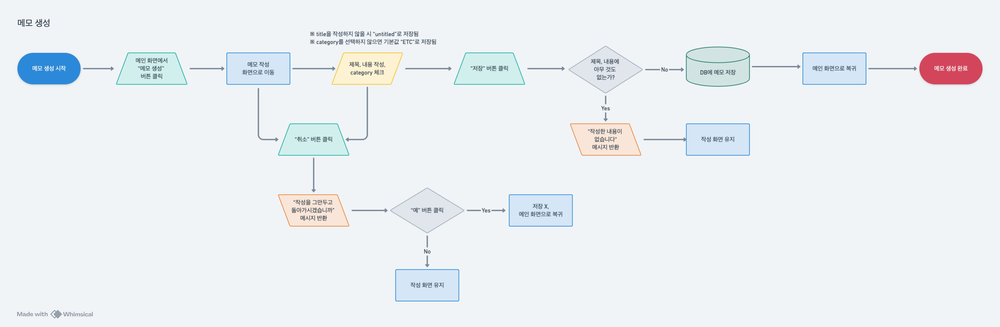

# MyMemo

개인 메모를 작성하고 관리할 수 있는 웹 애플리케이션입니다.

JWT 기반 인증을 통해 사용자별로 메모를 안전하게 구분하고, 카테고리 분류 및 고정 기능 등 실용적인 편의 요소도 함께 제공합니다.

  

## 프로젝트 소개

<b>MyMemo</b>는 간편하면서도 안전한 개인 메모장을 목표로 개발한 백엔드 중심의 웹 애플리케이션입니다.

사용자는 로그인 후 메모를 작성하고, 수정하거나 삭제하며, 고정 또는 분류할 수 있습니다.

또한 Swagger를 통해 직접 API 테스트가 가능하고, 인증 흐름도 명확히 분리되어 있습니다.

  

## 사용 기술 스택

- Java 17
- Spring Boot 3.2.5
- Spring Security
- MySQL
- JPA (Hibernate)
- JWT (Access Token 기반 인증 - Refresh Token 도입 예정)
- Swagger (springdoc-openapi)

  

## 기능 흐름도

아래는 MyMemo의 주요 기능 동작 흐름을 시각적으로 정리한 플로우 차트(flow-chart)입니다.

회원가입 플로우

※ Whimsical에서 제작

> 사용자는 이메일 인증을 통해 본인 확인을 한 후, 비밀번호 조건 검증과 입력값 유효성 검사 과정을 거쳐 회원가입을 완료합니다.

로그인 플로우

※ Whimsical에서 제작

> 사용자가 이메일과 비밀번호를 입력하면 서버는 DB에 등록된 사용자 정보를 확인하고, 인증에 성공할 경우 JWT 토큰을 발급하여 로그인 처리를 완료합니다.

메모 생성 플로우

※ Whimsical에서 제작

> 사용자가 메모 작성 화면에서 제목, 내용, 카테고리를 입력하고 저장하면, 유효성 검사를 거쳐 해당 메모가 DB에 저장됩니다.

메모 조회 플로우

※ Whimsical에서 제작

> 사용자가 메인 페이지에 진입하면, 서버는 JWT 인증을 통해 사용자 식별 후 전체 메모 목록을 JSON 형태로 응답합니다.

